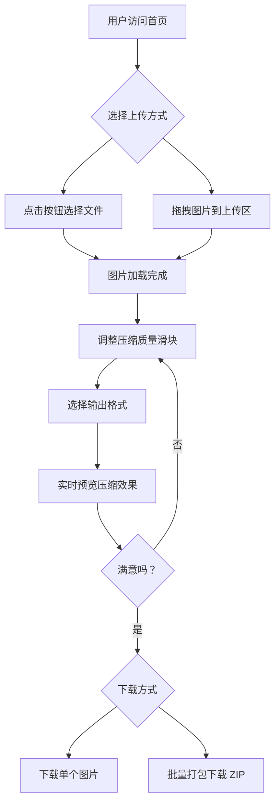

## 1. 产品概述

这是一个纯前端的在线图片压缩与格式转换工具，所有处理均在浏览器中完成，无需后端服务器。目标用户是全球英文用户，所有界面文字使用英文。

- **主要目的**：帮助用户快速压缩图片文件大小，同时保持视觉质量，支持多种格式转换
- **核心价值**：免费、快速、隐私安全（图片不上传服务器）、支持批量处理

## 2. 核心功能

### 2.1 用户角色
无需注册，所有访客均可使用全部功能。

### 2.2 功能模块
1. **首页**：文件上传区域、压缩设置面板、实时对比预览、下载功能区

### 2.3 页面详情

| 页面名称 | 模块名称 | 功能描述 |
|---------|---------|---------|
| 首页 | 文件上传区 | 支持点击按钮选择文件和拖拽上传，支持多文件批量上传 |
| 首页 | 压缩设置面板 | 质量滑块（0.1-1.0）、输出格式选择（Original/JPEG/PNG/WebP） |
| 首页 | 实时对比预览 | 并排显示原图和压缩后图片，显示文件大小和节省百分比 |
| 首页 | 下载功能区 | 单个下载按钮、批量打包下载（ZIP） |
| 首页 | 缩略图列表 | 批量处理时显示所有图片缩略图，可切换当前编辑图片 |

## 3. 核心流程

用户打开页面 → 上传图片（点击或拖拽）→ 调整压缩设置 → 实时预览压缩效果 → 下载压缩后的图片

## 4. 用户界面设计

### 4.1 设计风格
- **主色调**：深色背景配亮色强调，现代科技感
- **按钮风格**：圆角、渐变背景、悬停动效
- **字体**：现代无衬线字体，清晰易读
- **布局风格**：居中卡片式布局，响应式设计
- **图标风格**：线性图标，简洁现代

### 4.2 页面设计概览

| 页面名称 | 模块名称 | UI 元素 |
|---------|---------|---------|
| 首页 | Hero区域 | 大标题 "Compress Images Without Losing Quality"，副标题说明 |
| 首页 | 上传区域 | 虚线边框拖拽区，支持状态变化动画，拖入时高亮 |
| 首页 | 设置面板 | 质量滑块带数值显示，格式选择下拉框/按钮组 |
| 首页 | 对比预览 | 左右并排布局，原图/压缩图标签，文件大小信息，节省百分比（绿色） |
| 首页 | 下载按钮 | 主按钮样式，禁用状态，加载状态 |
| 首页 | 缩略图列表 | 横向滚动，选中状态高亮，删除按钮 |

### 4.3 响应式设计
- **桌面优先**：大屏幕充分利用空间，并排显示对比预览
- **移动端适配**：垂直堆叠布局，触摸优化，滑块易于操作
- **平板适配**：中等宽度时调整间距和布局

### 4.4 动效设计
- 页面加载淡入动画
- 拖拽悬停状态变化
- 压缩进度指示
- Vue Transition 组件实现平滑过渡
