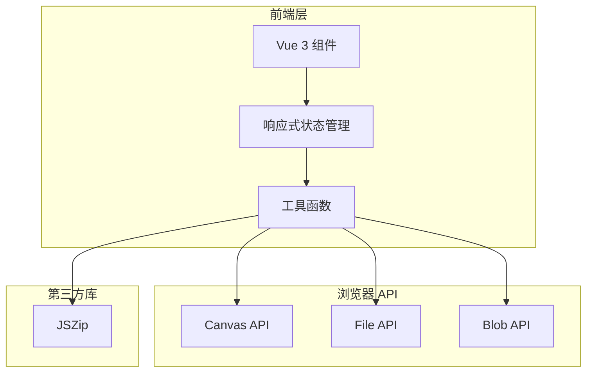

## 1. 架构设计



## 2. 技术说明

* **前端框架**：Vue 3 + TypeScript

* **构建工具**：Vite

* **CSS 框架**：Tailwind CSS

* **状态管理**：Vue 3 Composition API (ref, reactive, computed)

* **打包库**：JSZip（用于批量下载）

* **预渲染**：vite-plugin-prerender（SEO 优化）

* **初始化工具**：npm create vite\@latest

## 3. 路由定义

| 路由 | 用途          |
| -- | ----------- |
| /  | 首页，包含所有功能模块 |

本项目为单页应用，所有功能集中在首页完成。

## 4. 组件结构

```
src/
├── App.vue                 # 根组件
├── main.ts                 # 入口文件
├── components/
│   ├── UploadZone.vue      # 文件上传区域（拖拽+点击）
│   ├── SettingsPanel.vue   # 压缩设置面板
│   ├── PreviewCompare.vue  # 实时对比预览
│   ├── ThumbnailList.vue   # 缩略图列表
│   └── DownloadButtons.vue # 下载按钮组
├── composables/
│   └── useImageCompressor.ts  # 图片压缩逻辑
├── types/
│   └── index.ts            # TypeScript 类型定义
└── utils/
    └── imageUtils.ts       # 图片处理工具函数
```

## 5. 数据模型

### 5.1 核心类型定义

```typescript
interface ImageFile {
  id: string
  originalFile: File
  originalUrl: string
  compressedBlob: Blob | null
  compressedUrl: string | null
  originalSize: number
  compressedSize: number | null
  quality: number
  outputFormat: OutputFormat
}

type OutputFormat = 'original' | 'jpeg' | 'png' | 'webp'

interface CompressionSettings {
  quality: number
  outputFormat: OutputFormat
}
```

### 5.2 响应式状态

```typescript
const imageFiles = ref<ImageFile[]>([])
const currentIndex = ref<number>(0)
const settings = reactive<CompressionSettings>({
  quality: 0.8,
  outputFormat: 'original'
})
```

## 6. 核心算法

### 图片压缩流程

1. 读取原始图片文件
2. 创建 Canvas 绘制图片
3. 使用 `canvas.toBlob()` 进行压缩
4. 根据设置的质量和格式参数输出
5. 生成预览 URL 和文件大小信息

### 批量处理逻辑

* 使用 `Promise.all` 并行处理多张图片

* 统一设置应用于所有图片

* JSZip 打包所有压缩后的文件

## 7. SEO 配置

### index.html 元信息

* `<title>Free Online Image Compressor - Compress JPEG, PNG, WebP</title>`

* Meta description 包含关键词

* H1 标签：Compress Images Without Losing Quality

### 预渲染配置

使用 `vite-plugin-prerender` 对首页进行预渲染，确保：

* 构建时生成完整 HTML 内容

* 搜索引擎可直接抓取页面内容

* 提升首屏加载速度

